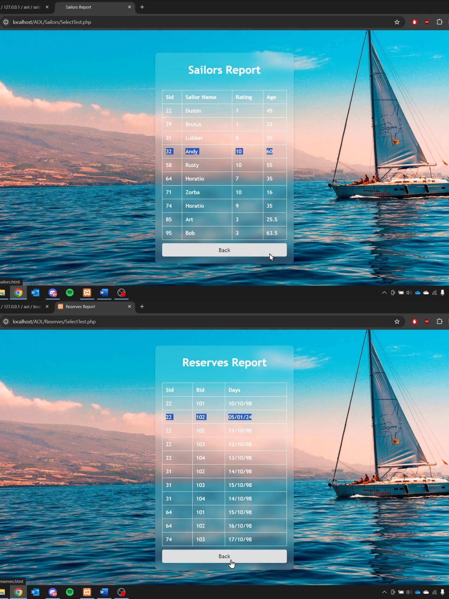
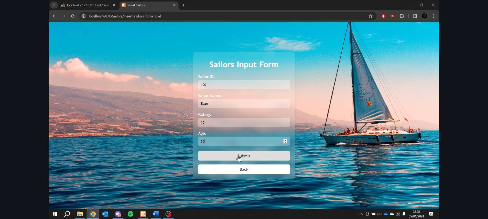

# A-BOAT-SAILORS-RESERVE
In this database project, we create a database management mechanism related to boat rental.

# Download Guide : 

  1. Download XAMPP, then turn on apache
  2. Used VSCode to RUN

# Implementation : 
  1. Open XAMPP, then turn on APACHE and MYSQL.
  2. Open Web Browser and search PHPMYADMIN.
  3. Open VSCODE and then open AOL folder.
  4. and Run the Code.

# Feature :
 - add / remove / see some data of the sailors, reserve and rent boat 
 - can see result of the data

# lampiran gambar : 

# preview link video demo aplikasi: 
https://drive.google.com/drive/folders/1fZHbflpVfW9Y_59NaSUZFrWIuSFBJ7oK?usp=drive_link
